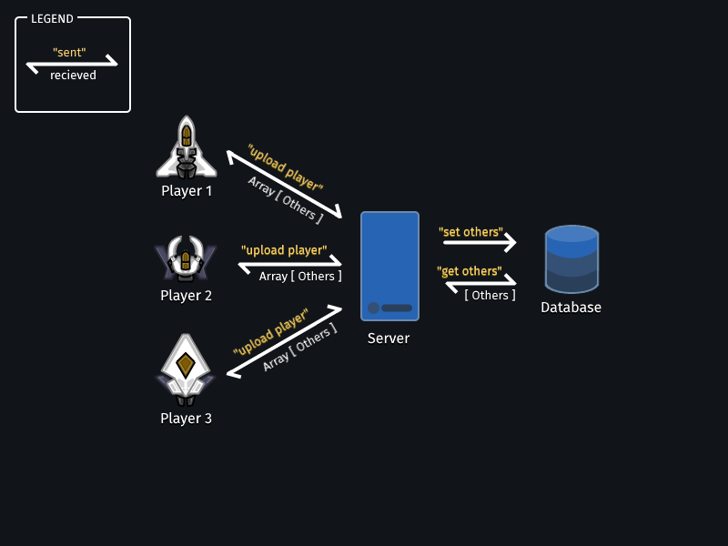

# Real-Time Web @cmda-minor-web · 2018-2019

## Live demo 💻

[Check out the live demo!](https://bittheory.herokuapp.com)

## Concept 💭
Yeet

<br/>

## Glossary 📚
<details>
  <summary>Click here to expand</summary>

- [Real-Time Web @cmda-minor-web · 2018-2019](#real-time-web-cmda-minor-web--2018-2019)
	- [Live demo 💻](#live-demo-%F0%9F%92%BB)
	- [Concept 💭](#concept-%F0%9F%92%AD)
	- [Glossary 📚](#glossary-%F0%9F%93%9A)
	- [Getting started 🏁](#getting-started-%F0%9F%8F%81)
	- [APIs 🐒🐒](#apis-%F0%9F%90%92%F0%9F%90%92)
	- [Data lifecycles ♻️](#data-lifecycles-%E2%99%BB%EF%B8%8F)
	- [Wishlist ❓](#wishlist-%E2%9D%93)
	- [Licence 📜](#licence-%F0%9F%93%9C)
</details>
<br/>
<br/>

## Getting started 🏁
```sh
#Clone the repo
git clone https://github.com/maanlamp/real-time-web-1819.git;

#Change into the newly made directory
cd real-time-web-1819;

#install dependencies
npm i;

#Start the server
npm run start;
```
<!-- ...but how does one use this project? What are its features 🤔 -->
<br/>

## APIs 🐒🐒
I make use of the bulle image API to get a background image for the game.

The Hubble telescope has made a lot of photos, which you can all get summarised by visiting the link http://hubblesite.org/api/v3/images?page=all.
This returns the following array:
<details>
  <summary>Hubble image array</summary>

```json
[
  {
    "id": 4490,
    "name": "Large Magellanic Cloud (DSS View) with Star Cluster Overlay (Hubble)",
    "news_name": "a",
    "collection": "news"
  },
  {
    "id": 4489,
    "name": "Three Steps to the Hubble Constant",
    "news_name": "b",
    "collection": "news"
  },
  {
    "id": 4491,
    "name": "Compass Image of Large Magellanic Cloud",
    "news_name": "c",
    "collection": "news"
  },
  ...
]
```
</details>
<br/>

To get the actual image from the API, you have to send a GET request to the http://hubblesite.org/api/v3/image/:id endpoint, where `:id` is one of the id's fetched from the image summary. This returns a JSON object containing information about the image, and the URI's needed to load the image. It looks somewhat like this:
<details>
  <summary>Hubble image array</summary>

```json
{
  "name": "Southern Crab Nebula",
  "description": ...,
  "credits": ...,
  "news_name": "a",
  "mission": "hubble",
  "collection": "news",
  "image_files": [
    {
      "file_url": "https://media.stsci.edu/uploads/image_file/image_attachment/31334/STSCI-H-p1915a-z-853x1000.png",
      "file_size": 1451341,
      "width": 853,
      "height": 1000
    },
    ...
  ]
}
```
</details>
<br/>

I filter the summary of images to only contain images of nebulae [(plural of nebula fyi.)](https://en.wikipedia.org/wiki/Nebula), select a random id out of the filtered summary, get its `"image_files"`, select the first (`0th`) file_url, and draw it onto the game's background. It serves some _stellar_ images!
- https://media.stsci.edu/uploads/image_file/image_attachment/31334/STSCI-H-p1915a-z-853x1000.png
- https://media.stsci.edu/uploads/image_file/image_attachment/31639/STScI-H-favorites-p1840a-480x630.jpg
- https://media.stsci.edu/uploads/image_file/image_attachment/31006/STSCI-H-p1842c-z-1000x879.png

<br/>

## Data lifecycles ♻️
Every player uploads itself to the sever every 33 milliseconds (~30 times per second). The server then sets/updates that player value in the _player database_. The server then fetches all players except the newly uploaded one, and then dispatches an event to the uploading socket. That event downloads the other players for drawing in the requestor client. The same cycle happens for bullets.



When a player joins, it is automatically uploaded through this generic lifecycle, and when the socket is disconnected, it removes the corresponding player from the database.

<br/>

## Wishlist ❓
- Netcode is done really naively -- it uploads and download player positions at about 30 times per second. This makes it really laggy sometimes when the server gets inevitably overloaded. I wanted to look more into volatile packets. Maybe even reduce the synchronisation rate to 15 or even 5 times a second, and only send player speed and direction, so that all clients can simulate the missing data themselves.
- I used my own game engine to make this game, that I'm developing alongside this repo. As a side effect, the engine I'm using now is outdated and underperforming (compared to the engine repo) because it would require rewriting the entire game to use the new engine.
- The background images fetched and filtered from the hubble API aren't filtered strictly enough. Some images are way too small, not visually pleasing, not correctly shaped or not actually a picture at all ([christmas cards for example](https://media.stsci.edu/uploads/image_file/image_attachment/31109/STSCI-HST-holiday039-pr1821-4x6.png)).

<br/>

## Licence 📜
Licensed under MIT