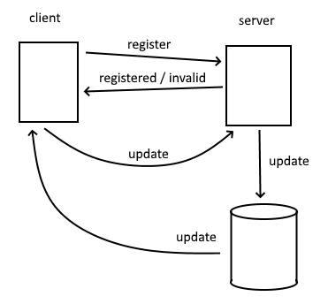

# Real-Time Web @cmda-minor-web · 2018-2019

Ik ben een real-time "Asteroids"-achtige multiplayer game aan het maken.

_**PEW PEW!**_

## Plan voor de laatste week:
### API die ik wil gebruiken
Voor het spel dat ik wil maken, wil ik random death messages halen uit een API. Als een speler dan een andere speler kapotschiet verschijnt er ergens op het scherm een grappige reden waarom. Ik zat te denken aan iets als [Perchance Deth Generator](https://perchance.org/random-cause-of-death-generator) of iets dergelijks. Ik heb nog steeds geen geweldig idee voor API.

### Data lifecycle

- Een client vraagt eerst de gebruiker om een username in te vullen.
- Via de `register` event vraagt de client aan de server of die username oké is.
  - Zo niet, wordt de `invalid` event afgevuurd en door de client ge"interpreteerd als invalide input.
  - Zo wel, wordt de `registered` event afgevuurd, waardoor de speler in de database wordt opgeslagen, en in de game van de client wordt geplaatst.
- Vervolgens wordt door elke client per gametick een `update` event gestuurd, die de positie van die player meegeeft.
- De server update daarop de positie van die speler in de database, en stuurt op zich dan weer een `update` event terug.
- Hierna slaan alle clients de posities van alle andere ruimteschepen op en visualiseren(/drawen) ze.

### Waar wil ik feedback op?
- Is deze API _goed genoeg_?
- Wat zou een betere API zijn (zelfs als het een goede is).
- Is er een betere manier om de multiplayer te implementeren (minder updates en interpoleren tussenin, etc.)?

<!-- Add a link to your live demo in Github Pages 🌐-->

<!-- ☝️ replace this description with a description of your own work -->

<!-- Add a nice image here at the end of the week, showing off your shiny frontend 📸 -->

<!-- Maybe a table of contents here? 📚 -->

<!-- How about a section that describes how to install this project? 🤓 -->

<!-- ...but how does one use this project? What are its features 🤔 -->

<!-- What external data source is featured in your project and what are its properties 🌠 -->

<!-- This would be a good place for your data life cycle ♻️-->

<!-- Maybe a checklist of done stuff and stuff still on your wishlist? ✅ -->

<!-- How about a license here? 📜 (or is it a licence?) 🤷 -->